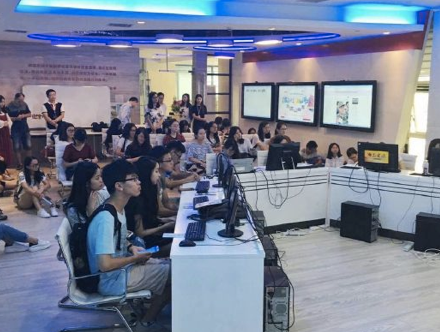
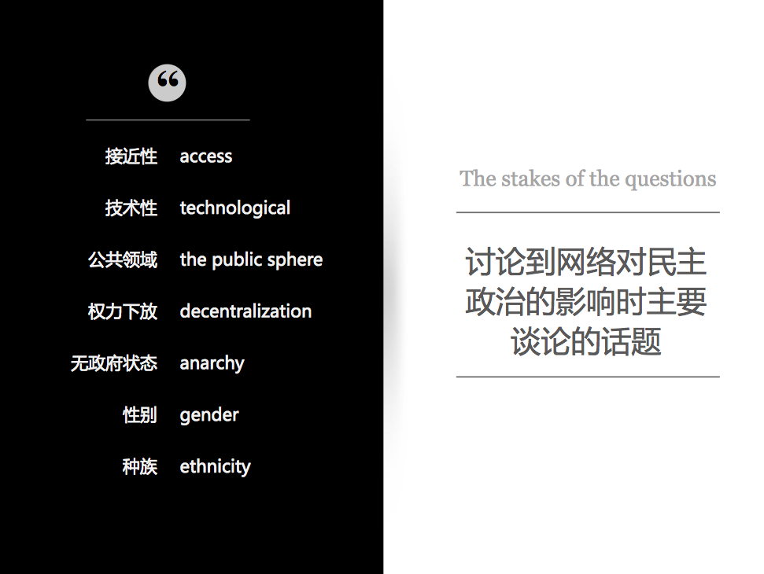
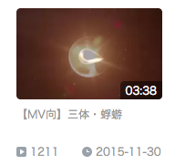
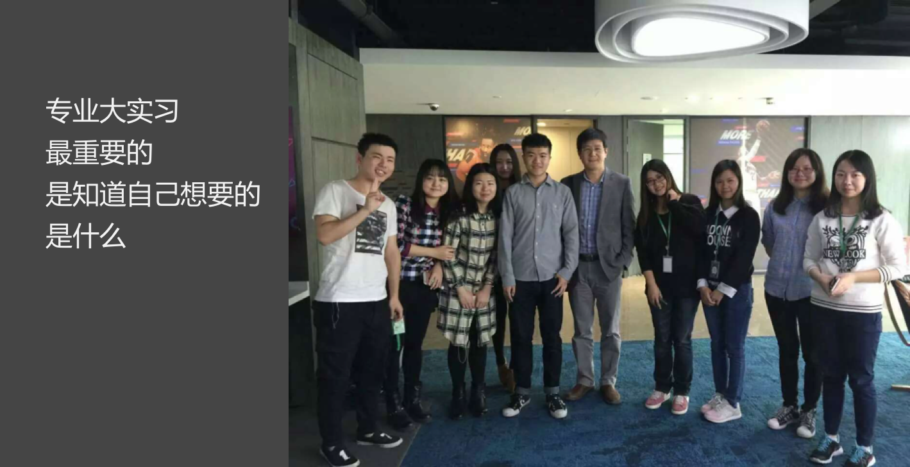

## 我所知道的网传

> 最重要的是知道自己想要的是什么
>
> ——肖珺 副教授

我并不会告诉你什么是网传，我只是希望与你分享我所知道的网传。

### 属于学生的传播学新媒体工作坊——狐说

*详情请扫描上方二维码，关注“狐说”*

*（图为14级网传学生参观荆楚网媒介实验室）*

截止目前，狐说已经在微信、微博、今日头条专栏、网易新闻客户端专栏、荆楚网等平台开通自媒体，**拥有上万名固定受众**。总而言之狐说就是网传老师跟学生捣鼓出来的一个很厉害的东西。

### 学术研究，懂一点传播学理论

*（图为国际传播学课程答辩PPT截图）*

`哈贝马斯`，`麦克卢汉`，`戈夫曼`，`吉特林`，`拉扎斯菲尔德`，`李普曼`，`麦奎尔`......这些名字你听过几个？

`《大众传播模式论》`，`《公众舆论》`，`《社会传播的结构与功能》`，`《自由而负责任的传媒》`，《`大众传播学》`，`《理解媒介》`......这些书你看过几本？

读了这么久的大学没人逼着你看书，是不是觉得也挺自在的？不过讲道理的话，你终究是来**读**大学的，不是吗？

记住上述人名与著作中提到的理论，在你复习考试的时候，帮助真的很大。当然，对我**认识这个世界**，也有一些微小的作用。

顺便安利一波[我院资料室](http://journal.whu.edu.cn/library/guide/introduction)。

### 初窥产品经理和互联网思维

### 网传学生会写代码这种事情也要告诉你吗？

*（图为网传学生编写的爬虫代码片段）*

我在**课程学习期间**制作的[个人首页](http://www.commedia.org.cn/~2013300710025/pw/lcc/index.html)（可能需要通过校园网登陆）。

如果你有兴趣的话也可以看看我的[个人博客](http://achuan.me/)。

### 视觉传达与设计，有和用武之地？

*（图为媒介工程实践课程作业设计稿）*

*（图为网传学生利用专业所学制作的网页设计稿）*

在**视觉传达**等课程上，你将有机会接触Ps，Ai，Id等各种工具了，似乎P图修图数据可视化不是难事了（我是指借此挣点零花钱）。

不过我想你应该知道，这并不代表选择了网传你就一定会用这些工具。如果不明白这个道理，可以问问选择了网传的学长学姐们。

如果你感兴趣的话，可以[点击查看](http://achuan.me/2016/01/31/productList/)我在**课余时间**完成的设计作品。也可以查看我的[个人作品集锦](http://www.zcool.com.cn/u/2512020/?mycate=0&type=0&sort=0&p=1#titleMaoDian)。

更多精彩的**网络传播专业历届学生的媒介实践作品**，[点击查看](http://www.commedia.org.cn/index.php)（可能需要通过校园网登陆）。

### 多媒体编创与动画制作，为什么这个也要学？

自己以后能做动画玩，光是想想就觉得很有趣。至于为什么要学，我只能说学了这玩意儿，再不济以后也能去外包公司剪视频吧（实际情况是，网站小编应当掌握视频剪辑的基础功能）。

数字媒体应用课程作业-视频剪辑-[《三体-蜉蝣》](http://www.bilibili.com/video/av3304901/)

网络动画编创课程作业-动画制作-[《青铜时代号的征途》](http://v.youku.com/v_show/id_XMTQyNjMwNDk2MA==.html?spm=a2hzp.8244740.userfeed.5!2~5~5~5!2~A#paction)

### 在互联网一线企业实习，发现你想要的

*（图为2016年实习期间同学与洪杰文老师的合影）*

扫描识别下方二维码，或直接点击[此处](http://netcommdog.github.io)，了解2013级网传班学生在一线互联网企业的实习感悟。

**以上。**

